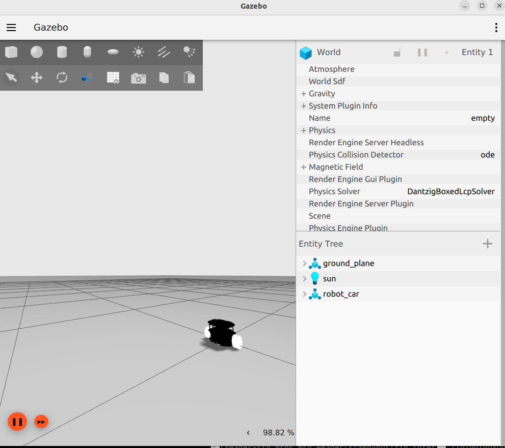
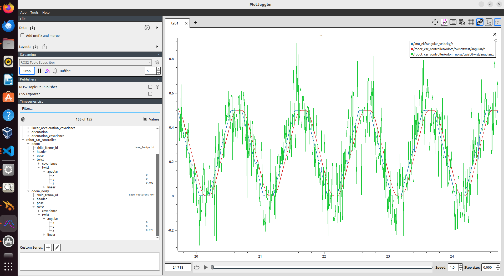

# Robot Car: IMU Sensors and Extended Kalman Filter

This project involves designing and building a custom robot car equipped with IMU sensors and an Extended Kalman Filter (EKF) for advanced sensor fusion, resulting in enhanced data accuracy. The robot’s behavior is simulated in Gazebo, allowing for detailed visualization and validation of sensor fusion. This custom design is adaptable for real-world applications, such as precision agriculture and autonomous navigation.
## Installation

**Prequisites**

* Ubuntu 22.04 LTS

* ROS2 humble

* Gazebo

**Step 1: Install ROS 2 Humble** 

Follow the [ROS 2 Humble installation](https://docs.ros.org/en/humble/Installation.html) instructions for your operating system if ROS 2 is not already installed.

**Step 2: Install Required ROS 2 Packages** 

Install the necessary ROS 2 packages.
```bash
sudo apt-get install ros-humble-ros2-control
sudo apt-get install ros-humble-ros2-controllers
sudo apt-get install ros-humble-xacro
sudo apt-get install ros-humble-ros-gz-*
sudo apt-get install ros-humble-*-ros2-control
sudo apt-get install ros-humble-joint-state-publisher-gui
sudo apt-get install ros-humble-turtlesim
sudo apt-get install ros-humble-robot-localization
sudo apt-get install ros-humble-joy
sudo apt-get install ros-humble-joy-teleop
sudo apt-get install ros-humble-tf-transformations


```
**Step 3: Install Python Packages** 

Install Python and additional packages:
```bash
sudo apt-get install python3-pip
pip install transforms3d
```
**Step 4: Additional Packages for Hardware Communication** 

To enable communication between the Arduino and ROS 2 using the Serial protocol:
```bash
sudo apt-get install libserial-dev
```

## Run Locally

Clone the project

```bash
  git clone git@github.com:shivasamkumar/AGV_Kalman_Filter_Robot.git
```

Go to the project directory

```bash
  cd robo_car
```

build the project

```bash
  colcon build 
```

Source your workspace

```bash
  source ~/workspace/install/setup.bash 
```

Launch the project

```bash
  ros2 launch robot_car_bringup robot_car.launch.py use_simple_controller:=False 
```
This would use the diff drive controller with Noise simulated. 

if true , it would simple controller designed , have a look at the implementation .  

## Demo





This image represents the visulation of Extended Kalman Filter through Plot juggler. The green line noisy controller implemented to recrate the life scenario and the red line is actual sensor output.


**Video**

This demo shows the Robot car controlled with a external joy stick. The project is digital twin and can deployed to external hardware (Rasberry pi) with slight modifications.

[](https://drive.google.com/file/d/1KlILhrtK5QHVsTOS9JB-yxl-etb1lK4Z/view?usp=drive_link)

**Click on the image to play the video**

## Future versions 
* **Web-Based GUI**

    Integrating a web-based control interface for remote access and operation, enabling users to control the robot arm from any device with internet access.

* **Localization, Mapping and Path planning and Execution**

    Implementing Navigation stack for path planning and execution combined with web based control. 

* **Hardware Integration**
